# ShadowNet 🌐

**The educational, production-grade Peer-to-Peer Mesh VPN.**

[](https://go.dev/)
[](https://nextjs.org/)
[](https://www.wireguard.com/)
[](LICENSE)
[]()

<!--  -->

---

## ⚡ Introduction

**ShadowNet** is a decentralized, peer-to-peer (P2P) mesh VPN that creates a secure private network over the public internet. Unlike traditional hub-and-spoke VPNs, ShadowNet allows nodes to communicate **directly** with each other, minimizing latency and eliminating central bottlenecks.

It is designed as an **educational reference implementation**, demonstrating advanced concepts like UDP Hole Punching, STUN, userspace packet processing, and the Noise Protocol Framework.

### 🚀 Key Features

*   **真正的 P2P (True P2P)**: Traffic flows directly between peers (A ↔ B) without touching the control plane.
*   **NAT Traversal**: Advanced UDP hole-punching technology connects peers behind residential routers, CGNAT, and strict firewalls.
*   **Userspace WireGuard**: Portable, kernel-independent implementation using `wireguard-go`.
*   **Zero Trust Architecture**: Identity is cryptographic (Public Key). IP addresses are just transport details.
*   **Split-Brain Architecture**: Strict separation of the **Control Plane** (Signaling) and **Data Plane** (Media).
*   **Modern Dashboard**: A real-time visualization of your mesh network.

---

## 📚 Documentation & Concepts

We have built a comprehensive, interactive documentation section directly into the dashboard to teach you how it works.

<!--  -->

Visit the **[ShadowNet Documentation Hub](./docs/concepts/CONCEPTS_AND_FLOW.md)** covering:
*   [Introduction to P2P Mesh VPNs](./docs/concepts/CONCEPTS_AND_FLOW.md#intro)
*   [WireGuard Protocol Internals (Noise_IK)](./docs/concepts/WIRE_GUARD.md)
*   [NAT Traversal & STUN](./docs/concepts/NAT_TRAVERSAL.md)
*   [TUN/TAP Device Integration](./docs/concepts/TUN_TAP.md)

---

## 🛠️ Architecture

ShadowNet operates on a "Split-Brain" model:

```mermaid
graph TD
    subgraph Control Plane ["📡 Control Plane (Signal)"]
        API[REST API]
        DB[(Peer Store)]
        API --> DB
    end

    subgraph Data Plane ["🕸️ Data Plane (Media)"]
        NodeA[💻 Node A]
        NodeB[💻 Node B]
        NodeC[💻 Node C]
    end

    NodeA -- "1. Register (HTTP)" --> API
    NodeB -- "1. Register (HTTP)" --> API
    
    NodeA -- "2. P2P Tunnel (UDP)" <--> NodeB
    NodeB -- "2. P2P Tunnel (UDP)" <--> NodeC
    NodeA -- "2. P2P Tunnel (UDP)" <--> NodeC

    style Control Plane fill:#f9f,stroke:#333,stroke-width:2px
    style Data Plane fill:#bbf,stroke:#333,stroke-width:2px
```



*   **Control Plane**: The "Phone Book". It helps peers find each other's current public IP:Port. It **never** sees or touches encrypted VPN traffic.
*   **Data Plane**: The "Call". Peers establish direct UDP tunnels using WireGuard.

---

## 🏁 Quickstart

### Prerequisites
*   **Linux** (Kernel 5.4+)
*   **Go** 1.21+
*   **Node.js** 18+ (for dashboard)

### 1. Run the Dashboard
The easiest way to explore ShadowNet is via the web dashboard.

```bash
cd web
npm install
npm run dev
```
Open [http://localhost:3000](http://localhost:3000) to see the mesh visualization and documentation.

### 2. Run the Control Plane (Server)
*(CLI Integration in progress - see Implementation Plan)*

```bash
# Start the signaling server
go run cmd/controlplane/main.go
```

### 3. Run a Node (Client)
```bash
# Join the mesh
sudo go run cmd/node/main.go --control-plane=http://localhost:8080
```

---

## 🧩 Technology Stack

| Component | Technology | Role |
|-----------|------------|------|
| **Core Networking** | `wireguard-go` | Userspace implementation of the WireGuard protocol |
| **NAT Traversal** | `pion/stun` | STUN client for public endpoint discovery |
| **Interface** | `water` (TUN/TAP) | OS-level virtual network interface creation |
| **Control Plane** | `Go` + `SQLite` | Signaling server and peer state management |
| **Dashboard** | `Next.js` + `Tailwind` | Real-time visualization and management UI |

---

## 👥 Contributing

ShadowNet is an open-source project designed for learning. We welcome contributions!

1.  Fork the repository
2.  Create your feature branch (`git checkout -b feature/amazing-feature`)
3.  Commit your changes (`git commit -m 'Add amazing feature'`)
4.  Push to the branch (`git push origin feature/amazing-feature`)
5.  Open a Pull Request

---

## 📄 License

Distributed under the MIT License. See `LICENSE` for more information.

*(WireGuard is a registered trademark of Jason A. Donenfeld.)*
