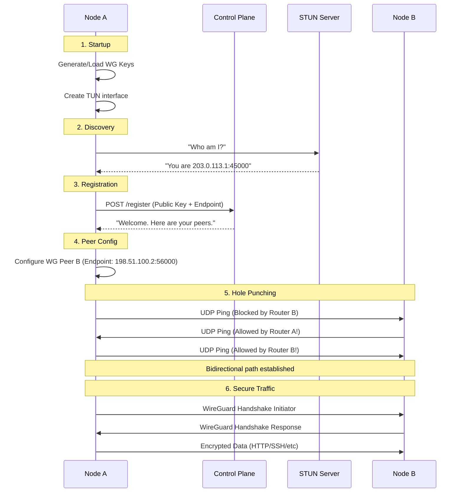

# ShadowNet Concepts & Application Flow

## Purpose
This guide provides a deep dive into the networking and systems architecture of ShadowNet. It explains *how* the components interact to achieve secure, peer-to-peer communication without a central data gateway.

## 1. Core Concepts

### Control Plane vs. Data Plane
The most critical design choice in ShadowNet is the strict separation of **Control** and **Data**.

*   **Control Plane (The Coordinator)**: This is a lightweight HTTP service (the "Phone Book"). Nodes talk to it to say "I'm online at this IP:Port" and to ask "Where is Peer X?". It handles authentication, peer discovery, and health checks. **It never sees a single byte of your actual traffic.**
*   **Data Plane (The Traffic)**: This is the direct, encrypted tunnel between two nodes. Once Node A knows Node B's address, they talk directly. If the Control Plane goes down, existing connections keep working perfectly.

### Userspace WireGuard & TUN Interfaces
ShadowNet runs WireGuard in **userspace** rather than as a kernel module. 

1.  **TUN Interface**: ShadowNet creates a virtual network interface (e.g., `tun0`). When your web browser sends a packet to `10.0.0.2`, the OS routing table sends it to `tun0`.
2.  **Packet Interception**: The ShadowNet process reads this raw IP packet from `tun0`.
3.  **Encryption**: It passes the packet to the `wireguard-go` library, which encrypts it for the destination peer.
4.  **UDP Encapsulation**: The encrypted blob is wrapped in a UDP packet and sent over the standard internet to the peer's physical IP address.
5.  **Decryption (Remote Side)**: The peer receives the UDP packet, decrypts it, and writes the original IP packet to its own `tun0` interface, where the OS receives it like normal network traffic.

### NAT Hole Punching
Most computers are behind NATs (Network Address Translators) and firewalls that block incoming connections. To allow P2P connections without manual port forwarding, ShadowNet uses **UDP Hole Punching**.

*   **The Problem**: If Node A (behind Router A) sends a packet to Node B (behind Router B), Router B will block it because it didn't ask for it.
*   **The Solution**: 
    1.  Node A sends a packet to Node B. Router A creates an outgoing rule, allowing replies from B. Router B drops this packet.
    2.  Simultaneously, Node B sends a packet to Node A. Router B creates an outgoing rule, allowing replies from A.
    3.  When Node A's packet arrives at Router B (or vice versa), Router B sees an existing outgoing rule for A and lets the packet in.
*   **STUN**: To make this work, nodes first ask a STUN server "What is my public IP and Port?". They share this information via the Control Plane so they know where to aim their hole-punching packets.

---

## 2. End-to-End Application Flow

The following diagram illustrates the lifecycle of a ShadowNet node connecting to the mesh.

## 3. detailed Node Lifecycle

### Step 1: Initialization
On startup, the node binary loads its configuration. If it's a fresh install, it generates a **Curve25519 key pair**. The private key is saved locally (usually in a config file or keyring) and **never leaves the device**.

### Step 2: TUN Device Setup
The node requests the OS to create a `TUN` device (requires `NET_ADMIN` capability). It assigns the mesh IP address (e.g., `10.100.0.1/24`) to this interface. At this stage, the interface is up, but no traffic can flow because WireGuard doesn't know any peers.

### Step 3: Endpoint Discovery (STUN)
Before it can receive traffic, the node needs to know its own public address. It sends a binding request to a STUN server using the **same UDP socket** it will later use for WireGuard traffic. This is crucial: it ensures the NAT mapping created for STUN is the same one used for peer traffic.

### Step 4: Sign-In (Control Plane)
The node sends a `POST /register` request to the Control Plane. It includes:
-   Its Public Key
-   The Public IP:Port discovered via STUN
-   Its Mesh IP

The Control Plane records this in its in-memory or database registry and responds with a list of all other active peers.

### Step 5: Mesh Configuration
The node iterates through the peer list received from the Control Plane. For each peer, it uses `wgctrl` to dynamically add them to the local userspace WireGuard device. It configures:
-   **AllowedIPs**: The peer's internal mesh IP (so traffic meant for them goes into the tunnel).
-   **Endpoint**: The peer's public UDP address (so the encrypted packets are sent to the right place).

### Step 6: The Hole Punch (Keepalive)
Simply knowing the endpoint isn't enough due to NATs. The node starts sending "keepalive" packets (empty UDP frames) to every peer's endpoint every 20-25 seconds (configurable). This keeps the NAT mapping open on the local router and helps "punch" through the remote router's firewall.

### Step 7: Handshake & Data
When the user tries to ping a peer, `wireguard-go` initiates a cryptographic handshake. Because of the hole punching in Step 6, these handshake packets successfully traverse the NATs. Once the handshake completes, the secure tunnel is established.

## 4. Failure Modes & Recovery

*   **Symmetric NATs**: If a node is behind a "hard" Symmetric NAT, port mapping is randomized for every destination. Simple hole punching often fails here. (Future Roadmap: Relay servers).
*   **Control Plane Outage**: If the control plane goes down, new nodes cannot join, and IP changes won't be broadcast. However, **existing peer-to-peer connections remain active** indefinitely as long as endpoints don't change.
*   **Key Loss**: If a node loses its private key, it effectively becomes a new node. The old entry will eventually time out from the control plane (if Heartbeats are implemented).
